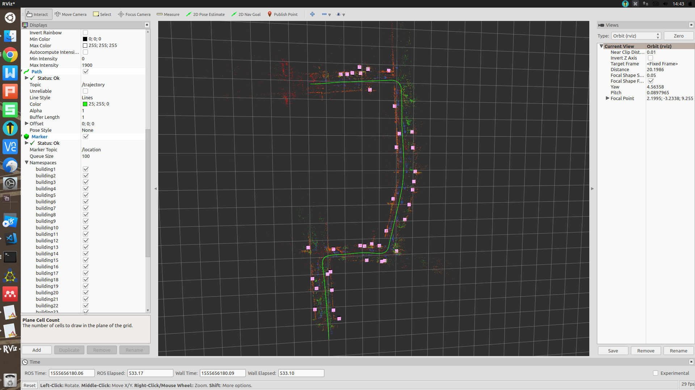
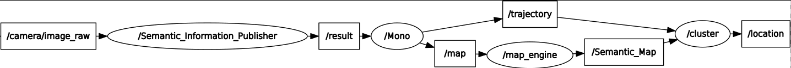

# Semantic SLAM

 <a href="https://996.icu"></a>

This on-going project is Semantic SLAM using ROS, ORB SLAM and PSPNet101. It will be used in autonomous robotics for semantic understanding and navigation.

Now the visualized semantic map with topological information is reachable, where yellow represents buildings and constructions, green represents vegetation, blue represents vehicles, and red represents roads and sidewalks. The cube is ambiguous building location and green line is the trajectory. You can visualize these information using Rviz. 



You can also get the semantic topological map which only contains the ambiguous building location and trajectory.


The whole ROS communication structure of the project is shown below.



## Bibliograhpy

If you are going to use our work in your research, please use the citation below.

``
@INPROCEEDINGS{8901910,
author={Z. {Zhao} and Y. {Mao} and Y. {Ding} and P. {Ren} and N. {Zheng}},
booktitle={2019 2nd China Symposium on Cognitive Computing and Hybrid Intelligence (CCHI)},
title={Visual-Based Semantic SLAM with Landmarks for Large-Scale Outdoor Environment},
year={2019},
volume={},
number={},
pages={149-154},
keywords={Semantic SLAM;Visual SLAM;Large-Scale SLAM;Semantic Segmentation;Landmark-level Semantic Mapping},
doi={10.1109/CCHI.2019.8901910},
ISSN={null},
month={Sep.},}
``

## New Update!

The system has been updated to the latest version. I have merged the semantic fusion mode with the SLAM system to achieve real time fusion and better loop closing performance. The map saving, map loading and localization modes have been completed. To run the new version of the system, please run the shell script "run_C.sh". You are welcome for issueing.

I have saved the old version of system in branch "version0.0.1".

## Prerequisite

Basic prerequisite.

* ROS kinetic
* Python 2.7
* scipy
* sklearn

To run the PSPNet in ROS, you have to install the following packages.

* Tensorflow-gpu >= 0.4.0 (0.4.0 is highly recommended)
* Keras 2.2.2

To run the ORB_SLAM2 in ROS, you have to install the following packages.

* C++11 or C++0x Compiler
* Pangolin
* OpenCVRequired at leat 2.4.3. Tested with OpenCV 2.4.11 and OpenCV 3.2.
* Eigen3 Required at least 3.1.0.
* DBoW2 and g2o (Included in Thirdparty folder)

## Project Structure

```
catkin_ws/
    src/
        map_generator/
        CMakeList.txt
src/
    cluster.py
    map_engine.py
Third_Part/
    ORB_SLAM/
    PSPNet_Keras_tensorflow/
test/
result/
.gitignore
README.md
run.sh
```

## RUN

First you have to compile the ``/catkin_ws`` using ``catkin_make`` to make sure that the message can be used. 

Then you have to read the README files in the ``/ThirdPart/ORB_SLAM`` and ``/ThirdPart/PSPNet_Keras_tensorflow`` and follow their command to make sure that the ORB SLAM and PSPNet can work correctly.

You can then run the script ``run.sh`` to use the system. You have to provide the rostopic ``/camera/image_raw``
```
cd Semantic_SLAM/
chmod +x run.sh
./run_C.sh
```

## TODO

* ~~Publish the cloud point infomation~~
* ~~Encode the cloud point and visual descriptor with semantic information~~
* ~~Clustering the cloud points into a single location point~~
* ~~Visualize the result~~
* ~~Run in the KITTI dataset~~
* Run in the TUM dataset
* ~~Use C++ for ROS node~~
* ~~Add localization mode~~
* ~~Add GPS fusion~~
* Run in simulation environment
* Benchmark in groundtruth
* Run in XJTU campus
* ~~Connect all the elements into a single project~~
* Inference accelerate


## Acknowledgement 

The state-of-the-art methodologies are achieved by team of [Raul Mur-Artal](https://github.com/raulmur) for [ORB_SLAM](https://github.com/raulmur/ORB_SLAM2) and team of [Hengshuang Zhao](https://github.com/hszhao) for [PSPNet](https://github.com/hszhao/PSPNet). Thanks for their great works.

The implementation of [PSPNet by keras](https://github.com/Vladkryvoruchko/PSPNet-Keras-tensorflow) is presented by [VladKry](https://github.com/Vladkryvoruchko). Thanks for their team's work.
